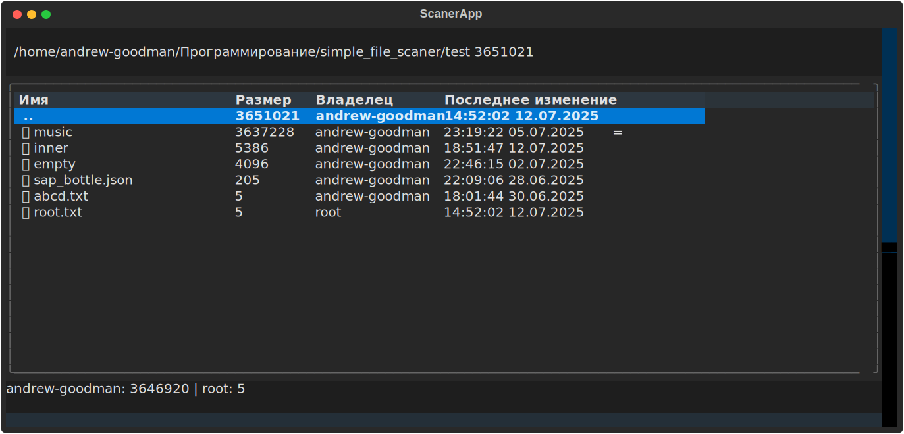

# Simple File Scaner
## Simple File Scaner - програмка, предназначенная для того, чтобы смотреть, сколько места занимают файлы и папки

### Использование  
*Для работы нужно установить textual: pip install textual*  
python3 main.py  
-b или --bytes: показывать размер в байтах

Перемещаться по таблице файлов можно стрелочками и колёсиками мыши, чтобы перейти в директорию надо нажать ENTER, родительская директория обозначена как ".."
  
Хоткеи:
- s: сортировка по размеру
- n: сортировка по названию
- o: сортировка по владельцу
- t: сортировка по времени последнего изменения
Снизу находятся фильтры, которые можно включать/выключать
